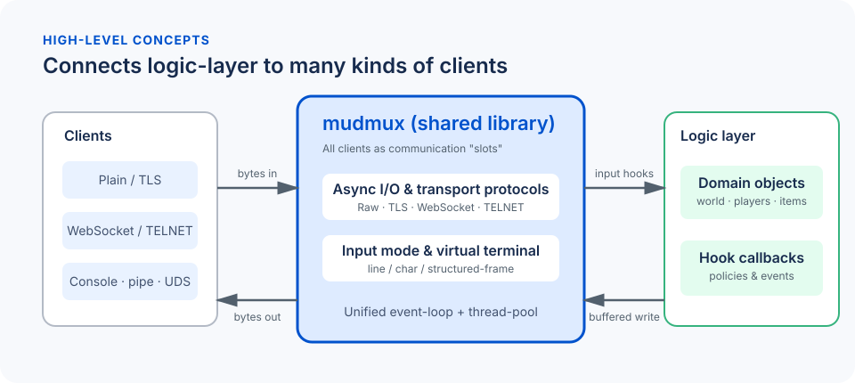

# mudmux

`mudmux` handles the painful **transport-layer** tasks (low-level network communication and asynchronous I/O) between MUD server and clients, generates **input events** for high-level logics layer, and enables graceful **non-blcoking** event loop to drive the virtual world.



## Features

Connection types:
- Network Sockets
- Websockets
- Local users (console, pipes, UDS)

Transport modes:
- **Line mode**: conventional MUD UX (e.g. `telnet`)
- **Char mode**: single character or virtual terminal control key
- **Structured messages**: for smart clients (e.g. graphical clients, AI agents, ... etc.)

Input mode can be switched at runtime per-slot via the communication API (`comm_set_line_input`, `comm_set_char_input`, `comm_set_echo` in `mudmux/comm.h`). ANSI/VT100 output processing can be enabled per-slot with `comm_enable_virtual_terminal`.

Transport layer integrations:
- TELNET Support
- TLS Support

In-Process integration with the MUD server:
- Loaded as a shared library and provides in-process C APIs for transport layer
- Interact with the main server by registered hook functions
- Provides RAII guards and multithread-safety synchronizations as C++ wrappers

## How to build

### Configure
```bash
# See `cmake --list-presets` for supported platforms
cmake --preset linux-gcc
```

### Build
```bash
# Use `dev-*` preset for fast development build; or `rel-*` preset for optimized release build
cmake --build --preset dev-linux-gcc
```

### Running Tests
```bash
# Use corresponding `unit-*` preset for configured platform
ctest --preset units-linux-gcc
```

# Examples

## Simple Chatroom

The [chatroom](examples/chatroom/) example server provides a simple demonstration for using `mudmux` to create a chatroom server.

The example enables both TELNET and TLS/SSL in its connection hook function:
```c++
comm_enable_telnet(slot);
comm_enable_tls(slot);
```

To run the example, you'll need to prepare a server certificate and the private key (using `openssl`, for example) and setup in the configuration file `mud.conf`.

You also need a telnet client with SSL support (on Ubuntu: `sudo apt-get install telnet-ssl`):
```bash
# start the example chatroom server
$ chatroom -f mud.conf

# then, in another terminal, connect to the chatroom server
$ telnet -zssl localhost 4000
Trying 127.0.0.1...
SSL: Server has a self-signed certificate
SSL: unknown Issuer: /C=US/ST=CA/O=Mudmux
Connected to localhost.
Escape character is '^]'.
Please enter your username: Annihilator^M
Welcome, Annihilator!
You are now logged in. Type your messages to chat with others.
You can also use slash commands like /help, /quit, etc. to interact with the chatroom.
[Annihilator] hi
You said: hi
[Annihilator] /quit
Bye!
Connection closed by foreign host.
```

