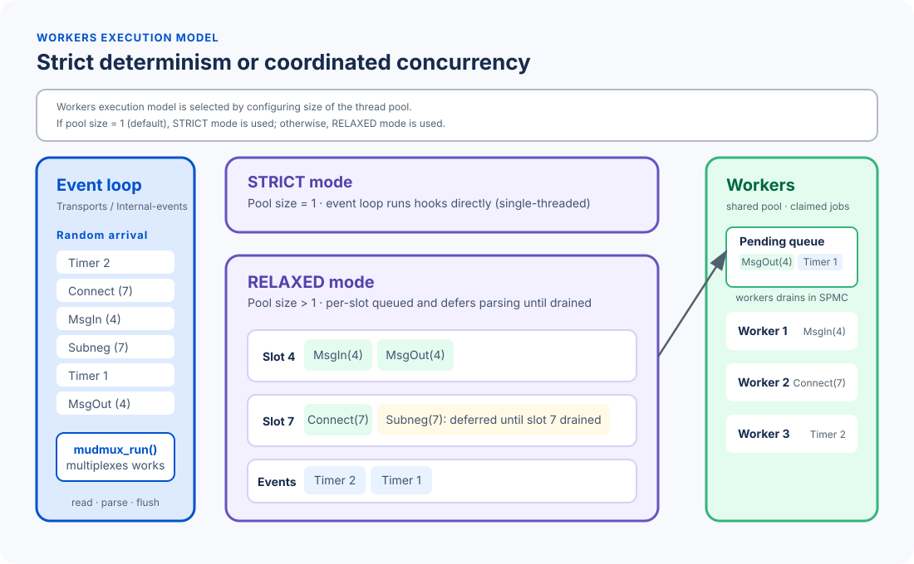

# Workers and Multi-threaded Applications

mudmux has one configured worker pool for asynchronous hook callbacks. The
event loop remains responsible for I/O; workers run application hook code when
relaxed concurrency is enabled. This division lets independent connections
make progress concurrently without letting two callbacks mutate the same slot
at once.



## Configure concurrency

Set `transport.thread_pool.size` in the YAML passed to `mudmux_init()`:

```yaml
transport:
  thread_pool:
    size: 1
```

The value defaults to `1`; values below `1` are rejected during initialization.

| Size | Mode | Application behavior |
| --- | --- | --- |
| `1` | Strict | Hooks execute on the event-loop thread with serialized behavior. |
| Greater than `1` | Relaxed | Eligible hooks may run on pool workers; hooks for different slots can overlap. |

Start with the default unless the application is prepared for concurrent hook
callbacks and nondeterministic ordering between different slots.

## What mudmux runs where

The event-loop thread always owns transport work: accepting connections,
reading and buffering bytes, parsing input, flushing output, and updating async
runtime registrations. It produces hook work but does not wait for workers to
finish before servicing other slots.

In strict mode, application hooks execute inline on that event-loop thread. In
relaxed mode, these hooks are eligible for worker execution:

- `HOOK_CONNECT`
- `HOOK_DISCONNECT`
- `HOOK_MESSAGE_INBOUND`
- `HOOK_MESSAGE_OUTBOUND`
- `HOOK_PROMPT`
- `HOOK_TELNET_SUBNEG`

`HOOK_TIMER` and registered non-slot async events use a separate serialized
event lane. They do not consume a communication slot's execution state.
`HOOK_GARBAGE_COLLECTION` always remains inline on the event-loop thread.

## Per-slot ordering and backpressure

Relaxed mode permits at most one callback in flight for each slot. Later
transport bytes for that slot remain buffered until the callback returns, so
mudmux never decodes a second inbound message or Telnet subnegotiation ahead of
the first. Hooks for separate slots may execute in parallel; no global
cross-slot ordering is guaranteed.

The scheduler has a bounded FIFO continuation queue of eight tasks per slot for
explicit, non-parser dispatches. Parser-originated inbound messages and Telnet
subnegotiations never enter that queue: if the slot is busy, dispatch reports
`MUDMUX_DISPATCH_QUEUE_FULL` internally and parsing is deferred until the slot
is idle. This bounds queued application work while preserving inbound order.

| Hook | When its slot already has a callback in flight |
| --- | --- |
| `HOOK_CONNECT` | The scheduler can queue explicit requests, although a normal accepted connection starts with connect. |
| `HOOK_DISCONNECT` | The terminal disconnect transition is retained and retried after the active callback. |
| `HOOK_MESSAGE_OUTBOUND` | May enter the target slot's bounded continuation queue. |
| `HOOK_PROMPT` | May enter the slot's bounded continuation queue. |
| `HOOK_MESSAGE_INBOUND` | Does not queue; inbound parsing pauses. |
| `HOOK_TELNET_SUBNEG` | Does not queue; Telnet parsing pauses. |

`HOOK_CONNECT` is the protocol-setup boundary. While it is running, same-slot
parser work is deferred; a close requested by connect is sequenced before
disconnect progresses. See [HOOK_CONNECT](hooks/HOOK_CONNECT.md).

## Writing thread-safe application hooks

Comm API calls from a mudmux hook may be made from either the event-loop thread
or a mudmux worker. The comm layer synchronizes its own slot and buffer state,
so a worker hook can, for example, write output or close its slot:

```c
static int on_input(void *context, int slot, void *data, size_t size) {
    (void)context;
    if (is_quit_command(data, size))
        (void)comm_close(NULL, slot);
    else
        comm_buffered_write(slot, "OK\n", 3);
    return 0;
}
```

That protection does not cover application-owned data. In relaxed mode, guard
shared worlds, session maps, caches, and other logic-layer state with the
application's own mutexes, atomics, or queues. Slot-local state accessed only
through one slot's callbacks is ordered; state shared across slots is not.

Do not retain internal `comm_abstract_ptr` objects or pass them to another
thread. Acquire and use them only within the current stack frame.

## Pool lifecycle and public APIs

`mudmux_init()` validates the configuration and starts the worker pool.
`mudmux_run()` produces work for the existing pool; it does not create or stop
workers. `mudmux_deinit()` stops and joins workers before tearing down the rest
of mudmux.

`<mudmux/workers.h>` also provides lifecycle controls for applications that
intentionally stop and restart workers while mudmux remains initialized:

- `mudmux_workers_start()` starts a stopped configured pool and returns `false`
  if it is already running or cannot start.
- `mudmux_workers_stop()` waits for queued work, stops and joins workers, and
  clears scheduler state. Do not call it from a worker callback.
- `mudmux_workers_pool_size()` reports the number of live workers; it is zero
  after stop.

`<mudmux/execution.h>` exposes `mudmux_is_running()`. It reports whether a
`mudmux_run()` call is active, not whether the worker pool exists. Use these
runtime-bound APIs after `mudmux_init()` and before `mudmux_deinit()`.

## Failure behavior and verification

Workers catch standard and non-standard C++ exceptions from submitted tasks,
log them, and continue processing later tasks. This prevents an uncaught hook
exception from terminating its worker, but it cannot recover from a process
fatal fault such as a segmentation fault or explicit process termination.

The regression suite covers same-slot ordering, progress on independent slots
while another slot is busy, queue-pressure deferral and resume, concurrent comm
API use from hooks, worker-thread prompt and connect hooks, and scheduler
stress. Sanitizer-backed stress testing remains useful for application-specific
shared-state designs.
